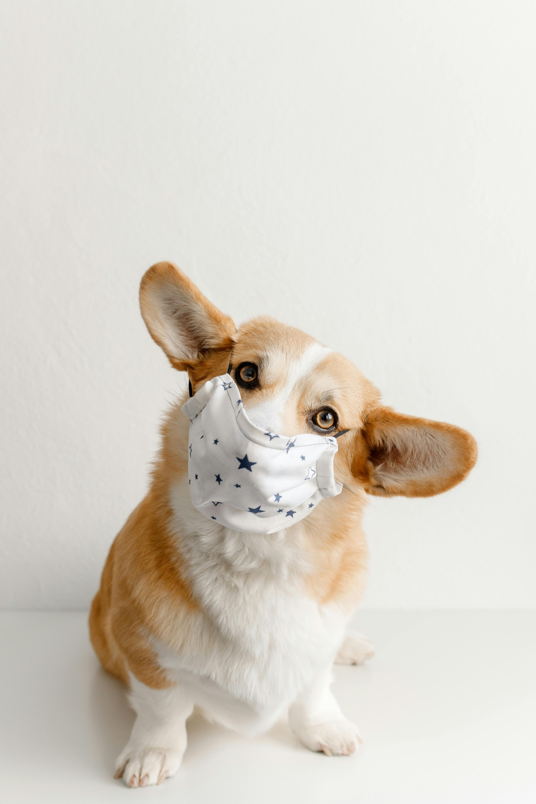

# Sitio Web de Veterinaria "Patas y Salud"

## 1. Título y Descripción del Proyecto:
- **Título:** 🐾 Patas y Salud – Cuidado Integral para Mascotas  
**Patas y Salud** es un sitio web desarrollado para ofrecer servicios veterinarios de calidad, información sobre cuidados para mascotas, y facilitar la reserva de citas médicas. La plataforma está diseñada para brindar un espacio amigable donde los dueños puedan cuidar la salud y bienestar de sus mascotas.

## Público Objetivo
- Propietarios de mascotas que buscan servicios veterinarios de confianza.
- Personas interesadas en aprender más sobre el cuidado de sus animales.
- Dueños que desean una plataforma fácil para reservar citas médicas.

## Estructura del Sitio
- **Inicio**
- **Sobre Nosotros**
- **Servicios**
  - **Consulta Veterinaria**
  - **Vacunación**
  - **Cirugía**
  - **Peluquería**
- **Tienda en Línea**
- **Consejos para el Cuidado de Mascotas**
- **Reservar Citas**
- **Contacto**
- **Registro y Login**

## Diseño y Estilo
- **Estilo visual:** Profesional, acogedor, confiable.
- **Colores:** Tonos de azul y blanco.
- **Tipografía:** Fuente clara y legible para facilidad de lectura.

## Contenido y Funcionalidades
- **Contenido:** Información sobre servicios veterinarios, consejos de cuidado, blog sobre salud animal.
- **Funcionalidades:**
  - Sistema de reserva de citas en línea.
  - Formulario de contacto.
  - Blog con artículos informativos sobre cuidado de mascotas.
  - Fotos y descripciones de servicios.
  - Registro y login de usuarios.
  - Tienda en línea para la venta de productos para mascotas.

## Cronograma Tentativo
- **Diseño y planificación:** 2 semanas
- **Desarrollo y programación:** 5 semanas
- **Creación de contenido:** 3 semanas

## Recursos Externos
- Integración de Bootstrap para formularios y diseño responsivo.
- Uso de Google Maps para mostrar la ubicación de la clínica.
- Integración de una API de reservas para citas en línea.
- Imágenes de mascotas y servicios adquiridas de bancos de imágenes con licencia.

## Desarrollos Futuros y Mejoras Potenciales
- **Historial Médico Electrónico:** Implementar un sistema para que los dueños puedan ver el historial médico de sus mascotas.
- **Newsletter:** Enviar boletines electrónicos sobre consejos de cuidado y promociones de la clínica.
- **Aplicación Móvil:** Desarrollar una app para facilitar la reserva de citas y comunicación directa con los veterinarios.

## Fecha de Entrega
